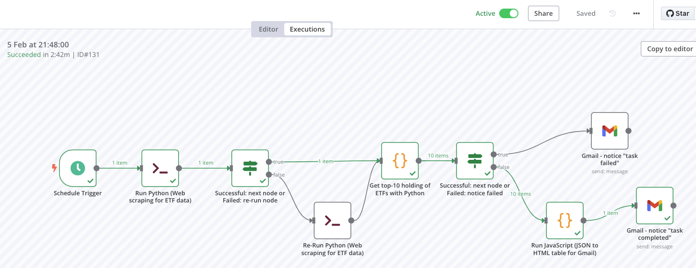
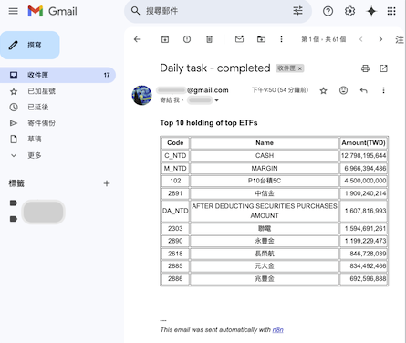

# **n8n_py_js_demo_01**

## **Implementing an example of integrating JavaScript and Python with n8n for Web Automation**

### **Ⅰ. Purpose** 
The content of this project is an experiment of integrating JavaScript and Python with n8n, powerful workflow automation software, for periodically collecting data from website.  

### **Ⅱ. Tools or Packages**
n8n, Selenium, Python, Javascript.   

### **Ⅲ. Statement**
 

__1. The data of web scraping__  

The targeted data is the holding details, like stocks, bonds and so on, of exchange-traded fund (ETF) in Taiwan. The ETFs are selected according to the standard that they primarily invest in stocks and their asset value is more than one hundred billion (TWD). Therefore, 8 ETFs are selected in this project. Their security codes are '0050', '00878', '0056', '00919', '00929', '006208', '00940' and '00713' respectively. 
In addition, the information about ETF ranking by asset value, trading volume and so on, in Taiwan can be read on the website, Yahoo Finance (Taiwan). (Please refer to [details](<https://tw.stock.yahoo.com/tw-etf/total-assets>)) 
  

__2. Data source__  

Thanks for the website, "https://www.pocket.tw/etf/", provided by Pocket Securities. This company, one of the best Online Brokers in Taiwan, delivers high-quality services to customers, and its website makes it easier for investors to obtain financial data and useful information.  
 

__3. Workflow__  

The workflow of n8n uses several types of node, including "Schedule Trigger", "Execute Command", "Code", "If", and "Gmail". The main steps are as below.
 
(1)Run python script to web scraping with Selenium and save results into JSON file inside docker container. Re-run python scritp, if failed. 
(2)node "Get top-10 holding of ETFs with Python" is to summarize data. If failed, the next node will notice "task failed" with Gmail. 
(3)Once successful, the next node will create HTML code with JavaScript for Gmail.   

 
 

__4. Results__  

As memtioned above, collecting data from website will be saved into JSON file. Then, the data will be summarize to statistical table for Gmail. Furthermore, regardless of whether the node "Get top-10 holding of ETFs with Python" completes or not, the workflow will send an email to announce recipient. 

(Concerning to the details, please refer to the files of this project)  

   

---

### **Ⅳ. References**

[1] [n8n](<https://n8n.io/>)

[2] [naskio/docker-n8n-python](<https://github.com/naskio/docker-n8n-python/tree/main>)

[3] [Selenium](<https://www.selenium.dev/>)

[4] [Yahoo Finance (Taiwan) - ETF asset ranking](<https://tw.stock.yahoo.com/tw-etf/total-assets>)

[5] [Pocket Securities - ETF](<https://www.pocket.tw/etf/>)